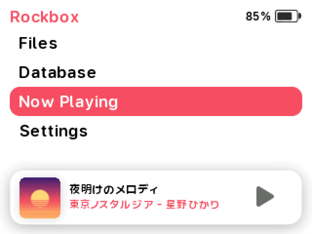
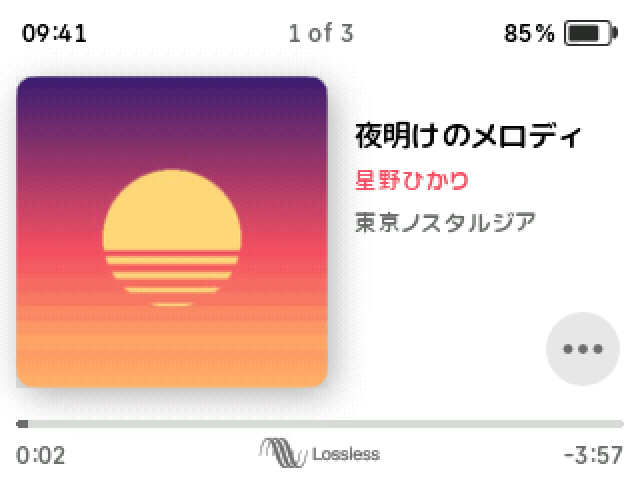
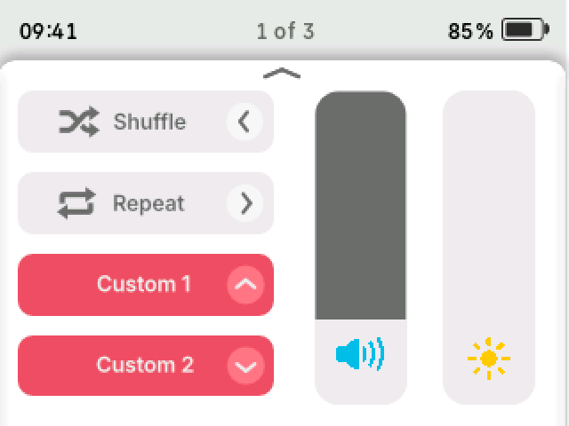
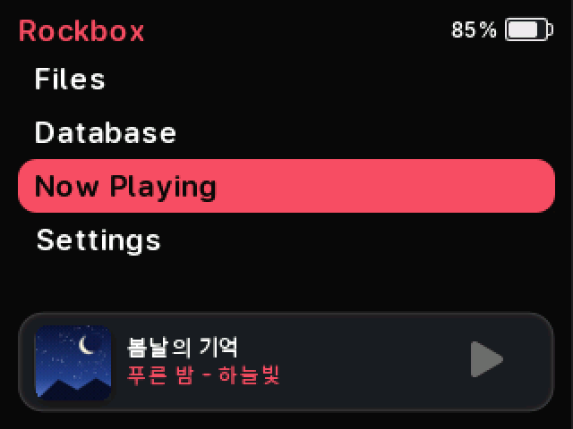
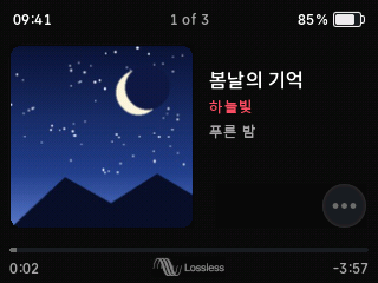
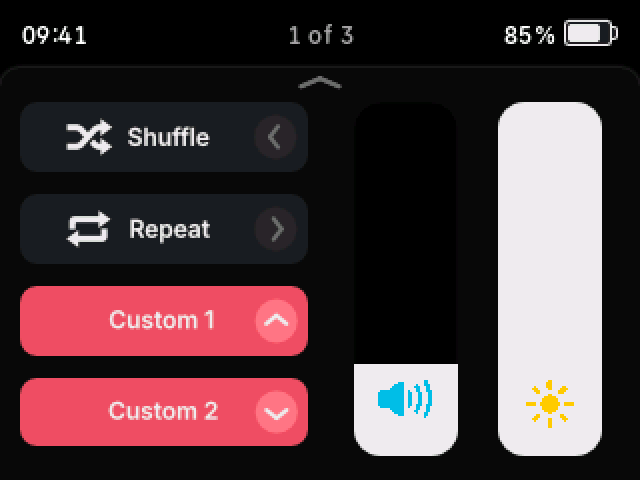
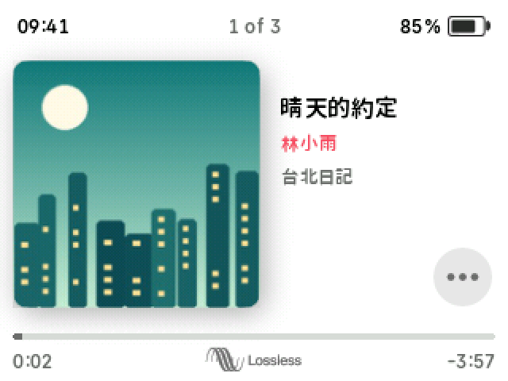

<p align="center">
  <picture>
    <source media="(prefers-color-scheme: dark)" srcset="docs/images/logo-dark.svg">
    
  </picture>
</p>

<p align="center">
  An Apple Music–inspired <a href="https://www.rockbox.org">Rockbox</a> theme for the iPod Video,<br>
  in light and dark, with Chinese, Japanese and Korean metadata support.
</p>

<p align="center">
  
  
</p>

> [!NOTE]
> **About this fork.** musicOS is created by Federico Pellegrino
> ([federicoplg/musicOS](https://github.com/federicoplg/musicOS)). This fork,
> musicOS-CJK, works on Chinese, Japanese and Korean support and on the
> repository's tooling, and offers its changes back to the original project.

## Screenshots

|           | Home | Now Playing | Quick Screen |
| :-------: | :--: | :---------: | :----------: |
| **Light** |  |  |  |
| **Dark**  |  |  |  |

<sub>Rendered in the Rockbox simulator for the iPod Video. The tracks, artists and
cover art are made up for the screenshots.</sub>

## Features

- **Home Screen:** the Rockbox menu with a rounded pink selection bar, and a
  mini player with album art, title, album, artist and playback state.
- **Now Playing:** large album art; title, artist and album; a progress bar
  that turns into a volume bar while you change the volume; clock, track
  count and battery; shuffle and repeat state; and a Lossless badge for
  lossless files.
- **Quick Screen:** shuffle, repeat and two custom toggles next to vertical
  volume and brightness sliders.
- **Dark Mode:** every screen redrawn for a dark background, not just
  recoloured.
- **CJK metadata:** titles, artists and albums in Japanese and Korean, and
  partly in Chinese ([details](#chinese-japanese-and-korean)).

## Chinese, Japanese and Korean

| Japanese | Korean | Chinese (Traditional) |
| :------: | :----: | :-------------------: |
|  |  |  |

musicOS uses [Sunghyun Sans Disambiguated](https://github.com/anaclumos/sunghyun-sans),
a rounded typeface, converted to Rockbox bitmap fonts in four sizes. Rockbox
cannot fall back to a second font, so a character these fonts lack is drawn
as a blank space. Coverage is the same in all four sizes:

| Language              | Character set                                          | Coverage |
| --------------------- | ------------------------------------------------------ | -------: |
| Korean                | All 11,172 Hangul syllables                            |     100% |
| Japanese              | JIS X 0208 kanji, levels 1 and 2 (6,355)               |     100% |
| Japanese              | Hiragana and katakana (all but the rare small ゕ and ゖ) |      99% |
| Chinese (Traditional) | Big5 common characters (5,401)                         |      85% |
| Chinese (Simplified)  | GB 2312 level 1, the most common 3,755                 |      64% |

Korean and Japanese are covered for their standard character sets. Chinese
is partial: common characters such as 你 and 她 are missing, and Simplified
Chinese also lacks 们, 这, 说 and 爱. Filling these gaps needs fonts rebuilt
with extra Chinese glyphs. `python3 scripts/font_coverage.py` measures the
coverage of any `.fnt` file.

If text you expect to see is missing, please
[open an issue](../../issues/new/choose) with the exact title, artist or album.

## Install

1. Install [Rockbox](https://www.rockbox.org) on the iPod.
2. Download `musicOS-<version>.zip` from [Releases](../../releases) and
   extract it.
3. Copy the contents of its `rockbox` folder into the `.rockbox` folder on the
   iPod, merging folders.
4. On the iPod, choose **Settings → Theme Settings → Browse Theme Files →
   `musicOS_v2`** (light) or **`musicOS_v2_dark`** (dark).

[INSTALL.md](INSTALL.md) covers hidden folders, updating, uninstalling and
troubleshooting.

**Compatibility:** designed for and tested on the iPod Video 5th/5.5th
generation (320×240). The iPod Classic 6th/7th generation is experimental.

## Repository layout

```text
rockbox/                 the theme, laid out like the iPod's .rockbox folder
├── fonts/               Sunghyun Sans bitmap fonts and the UI_Vectors icon font
├── themes/              musicOS_v2.cfg (light) and musicOS_v2_dark.cfg (dark)
└── wps/                 Now Playing (.wps) and Home/Quick Screen (.sbs) skins,
                         each with a folder of the bitmaps it loads
scripts/                 check.py, checkwps.sh, build.py and font_coverage.py
docs/images/             logo and screenshots
CHANGELOG.md             every release, newest first
```

Released versions are git tags (`v0.2.1-alpha`, …) with packaged zips on the
[Releases](../../releases) page, so the repository holds only the current
theme.

## Development

```sh
python3 scripts/check.py     # every referenced bitmap and font exists and is valid
scripts/checkwps.sh          # Rockbox's own skin parser (needs a C compiler and SDL2)
python3 scripts/build.py     # dist/musicOS-<version>.zip
```

[CONTRIBUTING.md](CONTRIBUTING.md) explains how the skins fit together, how to
test changes, and how to cut a release.

## Credits and license

musicOS is by Federico Pellegrino. It was developed with reference to the
Interpod themes by Christian Soffke and uses the Sunghyun Sans typeface; see
[CREDITS.md](CREDITS.md).

The bundled fonts are under the SIL Open Font License 1.1
([FONT-LICENSE.txt](FONT-LICENSE.txt)). The theme itself does not have a
license yet ([federicoplg/musicOS#2](https://github.com/federicoplg/musicOS/issues/2)),
so default copyright applies: ask the author before redistributing modified
versions.

musicOS is an unofficial fan project, not affiliated with Apple. Apple Music
and iPod are trademarks of Apple Inc.
